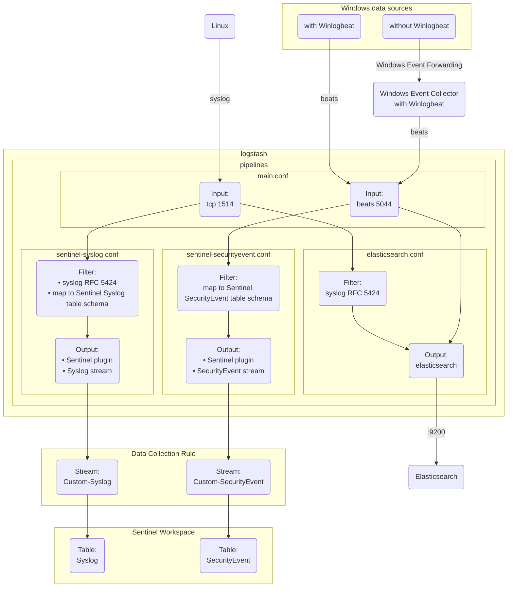

## 1. Logs flow

Sentinel supports [ingestion using Logstash](https://learn.microsoft.com/en-us/azure/sentinel/connect-logstash-data-connection-rules) via the [logs ingestion api](https://learn.microsoft.com/en-us/azure/azure-monitor/logs/logs-ingestion-api-overview)



## 2. Data sources

- Windows:
  - Direct collection with Winlogbeat: Winlogbeat sends events directly to Logstash over the Beats protocol on port 5044
  - Centralized collection via Windows Event Collector (WEC): leverage Windows Event Forwarding (WEF) to consolidate events to a WEC server running Winlogbeat to forward to Logstash
- Linux: Send syslog directly to Logstash TCP input on port 1514

Details on ingesting logs to elastic stack [here](https://github.com/joetanx/setup/tree/main/elastic)

## 3. Logstash pipelines

The example pipeline files in this directory are used in Logstash in this structure:

```
/usr/share/logstash/
├───config/
│   └───pipelines.yml
└───pipeline/
    ├───elasticsearch.conf
    ├───main.conf
    ├───sentinel-securityevent.conf
    └───sentinel-syslog.conf
```

The [pipelines.yml](/collection/logstash-plugin/pipelines.yml) is defines all available pipelines and their corresponding configuration files; Logstash reads this file on startup to initialize multiple concurrent pipelines

https://github.com/joetanx/sentinel/blob/bd63363ec7688359bc9066f8b8557146539cb0c5/collection/logstash-plugin/pipelines.yml#L1-L9

|Pipeline|Purpose|
|---|---|
|[main](/collection/logstash-plugin/main.conf)|Entry point pipeline: receive events on TCP syslog (1514) and beats (5044) and route to downstream pipelines|
|[elasticsearch-output](/collection/logstash-plugin/elasticsearch.conf)|Both syslog and beats events are sent to Elasticsearch for local visibility via Kibana|
|[sentinel-syslog-output](/collection/logstash-plugin/sentinel-syslog.conf)|Transform syslog events to Sentinel's `Syslog` table schema and send to the table|
|[sentinel-securityevent-output](/collection/logstash-plugin/sentinel-securityevent.conf)|Transform Windows security events to Sentinel's `SecurityEvent` table schema and send to the table|

## 4. Sentinel Logstash output plugin

Logstash sends logs to Sentinel via the [microsoft-sentinel-log-analytics-logstash-output-plugin](https://github.com/Azure/Azure-Sentinel/tree/master/DataConnectors/microsoft-sentinel-log-analytics-logstash-output-plugin)

Insall the plugin with `logstash-plugin install` in Logstash:

```sh
podman exec logstash logstash-plugin install microsoft-sentinel-log-analytics-logstash-output-plugin
```

### 4.1. Logs ingestion API and Data Collection Rules (DCR)

The Sentinel Logstash plugin uses logs ingestion API and DCR to send events to Sentinel

More details on setting up [here](/logs-ingestion-api)

## 5. Events received in Sentinel

### 5.1. Linux


### 5.2. Windows


