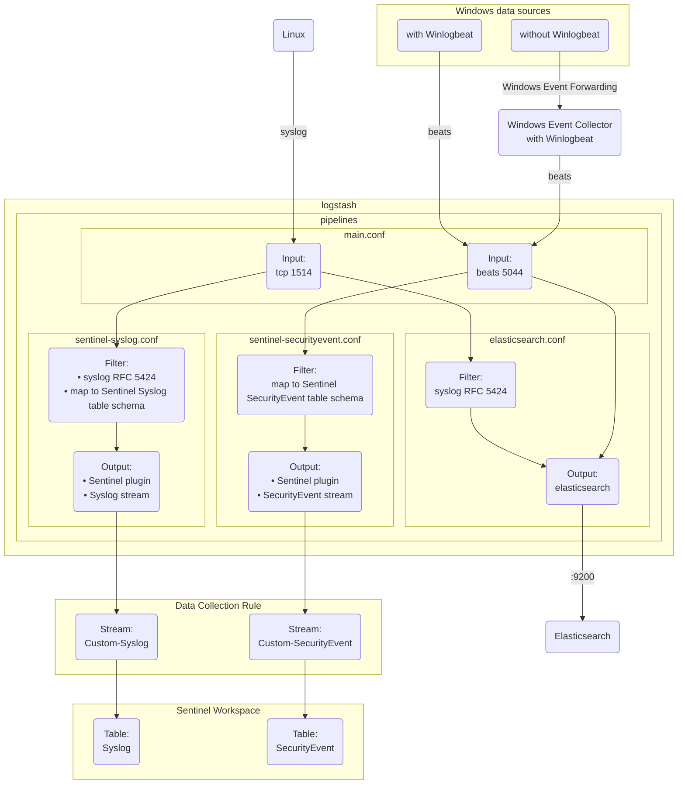

## 1. Logs flow



## 2. Sentinel Logstash plugin

https://learn.microsoft.com/en-us/azure/sentinel/connect-logstash-data-connection-rules

https://github.com/Azure/Azure-Sentinel/tree/master/DataConnectors/microsoft-sentinel-log-analytics-logstash-output-plugin

Install the Sentinel Logstash plugin:

```sh
podman exec logstash logstash-plugin install microsoft-sentinel-log-analytics-logstash-output-plugin
```

## 3. Logstash pipelines

### 3.1. Specify pipeline files in config

```
/usr/share/logstash/config/
└───pipelines.yml
```

https://github.com/joetanx/sentinel/blob/bd63363ec7688359bc9066f8b8557146539cb0c5/collection/logstash-plugin/pipelines.yml#L1-L9

### 3.2. Pipeline files:

```
/usr/share/logstash/pipeline/
├───elasticsearch.conf
├───main.conf
├───sentinel-securityevent.conf
└───sentinel-syslog.conf
```

## 4. Events received in Sentinel

### 4.1. Linux


### 4.2. Windows


